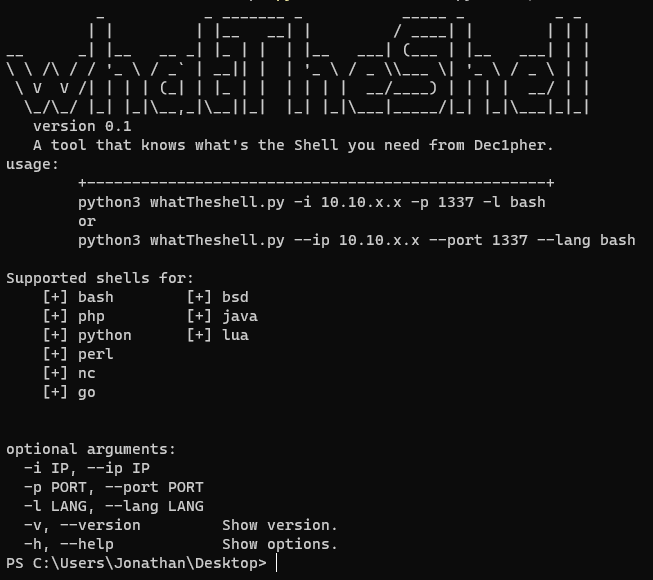

# What is it ?
A simple python3 tool that generates the payloads you always have to search.

# The reason
Why did I go off my way to create a simple yet time consuming script that autogenerates the reverse payload that I need? The idea behind that script was to learn a little about how python is used to create usefull cli tools like impacket. After the initial struggle I thought that I could make something usefull for me applying the skills that I learnt (and let me tell you that you have seen better skill but it's what I have for now :)). So Thinking of what I could make I choose to create that script that borrows a lot of the reverse shells from the famous repo [PayloadAllTheThings](https://github.com/swisskyrepo/PayloadsAllTheThings/blob/master/Methodology%20and%20Resources/Reverse%20Shell%20Cheatsheet.md) and wiht the help of f-strings and the argparser library I created my first cli python tool

# But why ?
Everytime I am doing a box in htb I find my self drowning the amount of terminals and browsers that are open. Also having to always to remmeber every single payload it's a little bit tedious. So in order to make my life easier and having one less browser tab open I am using this script to generate my payloads.

# Is it just for me ?
That's how it started to create it and keep it for me since it's not something amazing of a tools but maybe someone will find some use out of it so here it is. If you want it take it. I am looking to add more fanctionality in the future (powershell payloads, msfvenom etc.) but for now I added just the ones that I use the most. If you have a suggestion or you want to add a payload you can do it or just create an Issue and I will add it.

## References
> The original repo: [PayloadAllTheThings](https://github.com/swisskyrepo/PayloadsAllTheThings)
